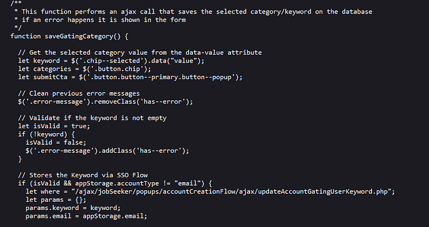
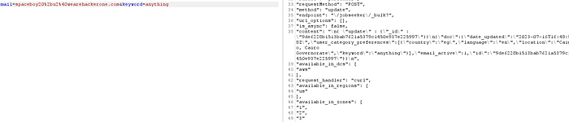
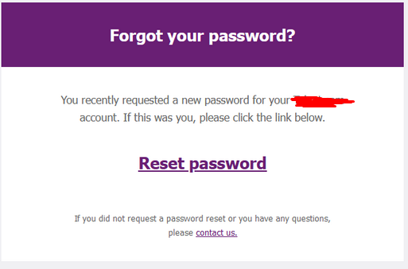
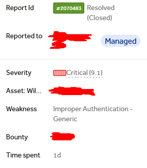

# Account takeover hidden in Javascript files plus some extra work? my type.

Hey guys, after my latest account takeover I decided to collaborate with one of my friends on the same program I got the first ATO on. Was it useful? will see.

---

## TL;DR:

I found an endpoint that leaks the id of the user then through other endpoint I was able to grab the reset password token that enabled me to takeover any user's account using Email only.

---

Now, through these words i'll be describing the methodology or how we think of certain things rather than just giving you the proof of concept

So, Lets start!

At first, after having the other ATO my friend decided to collab with me, he took a second look on the js files and grabbed all the endpoints and it was for us to try every and each endpoint manually and they were about 200 endpoint :D. ( Why did we do such thing manually? most of the endpoints needed specific parameters and to check whether its a GET or POST request so it needed lots of js reading!)

And while checking the endpoints that we collected manually, we found this in the js files

It was an endpoint that's used to define the type of advertisements to be sent to the user on his email and it's only used for the accounts that were registered with SSO. However, the endpoint itself didn't validate whether it's sso or normal email and if you send a request with any email you have it would simply response to you with the location the user selected on that email so it was actually leaking PII + we were modifying the keywords of that person to customize the type of ads that were sent to him.

and below that it included some internal ips ;). it was 3 AM so I reported it ( It was closed as infomrative, don't ask me why ) and sent my finding to my friend so he can see if we can esclate it further.

On the morning we went out for endpoints that required that "id" as we had an idea in mind that this looks like the unique id for the user and we can find idors with it or even worse .. ATO? so up till now is a flow (Email -> unique uuid )

we used gau, waybackurls and crawling the website looking for more endpoints that are using this ID and one endpoint appeared from nowhere

that was the endpoint we found

as we can see it took user_id and when we open this endpoint, we will see that this actually sent us an advertisement to our email so we thought of email bombing as we can use any email on the website and send it many advertisements mails leading to unsubscriping users from it or, we can actually unsubscribe the user !

At this point we kept searching for other endpoints while we sent the above link to sqlmap to check if id is vulnerable for sql injection, however my friend checked what if we actually set id=2 ?

At this moment he was shocked but when he tried to press on the reset password word, it told him token is invalid. However, everything made sense now.

emailPreview endpoint was meant for developing/testing and it was simply testing the functionality of sending emails but forgotten there so I said, if this is testing emails sent to mail, shouldn't we send a mail first before we try to use this endpoint? and here was the last piece of the puzzle

Go to login page -> press reset password -> now enter victim email -> go to our first vulnerable request that gave us user_id -> take that user_id and go to the emailPreview endpoint and

**bingo**

**takeaways**

if you find user uuid leaked anywhere, go fuzz for endpoints using it and use your burp search for easing the process.

Thanks for reading and wait for more writeups.
