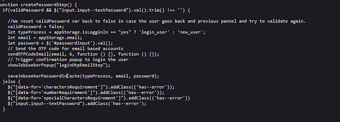
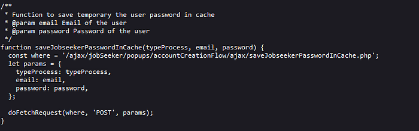
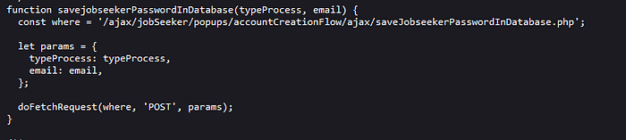

# Account takeover hidden in Javascript files.

Hey guys,

I'm here to share a broken access control bug I found on a private program on h1 which enabled me to take over any account with knowing its email only.

## Methodology :

I noted down some things which I saw in the website, how it register users and login them in and etc. Register flow was Simple OTP that you receive on the email you registered with. So at this point, without having many functionalities to poke with, I decided to go to javascript files to analyse the source code.

I saw this method on the code

The thing that caught my mind is, there's no mention for this method anywhere else so I guessed that this is either under development or from past login ways. Anyway, tracking the `sendOTPCodeEmail`, it was valid and I couldn't find something interesting in it. However, `saveJobseekerPasswordInCache` function was so **INTERESTING!**

So this endpoint took 3 parameters. So I thought there's no actuall checks there because the website actually thinks that the user still registering on the website so I decided to try to find out how's the request sent by replicating the flow that happens in doFetchRequest and it was a simple one. I successfully entered my other mail I use for testing and a password that I created but nothing changed and I couldn't just figure out what did I lack or maybe the actual code is redundant as I thought. But here comes the life saver, saveJobseekerPasswordInDatabase!

seems our scenario has got to an end! Now I tried to send the email I used in the first request and I received a very nice ( PASSWORD HAS CHANGED SUCESSFULLY ) and I was able to login to that account with the new password I put.

So it needs the two requests to be fired with sequence as we obviously need to store the password in the cache of the app — in this case we can consider it as a different table in the database that has email and password — then it actually store the password we entered the password we sent on the users' table.

## Takeaways:

1- Always try to read javascript files and methods, not only to search for secrets but it will reveal the application for u.

2- Enjoy finding bugs rather than what would a program rate you because this bug was out of scope :D ! I didn't notice that Authentication testing is out of scope but I enjoyed reporting my first ATO.

Thanks for reading!
