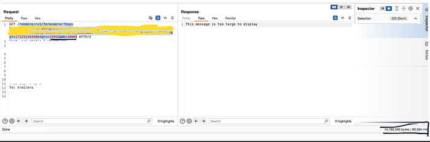
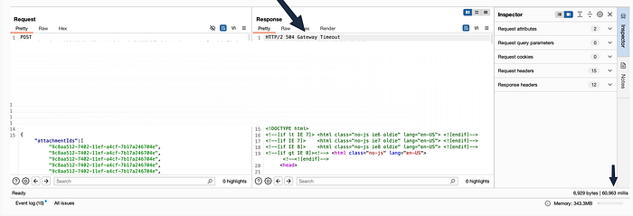
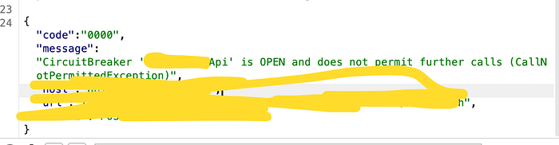
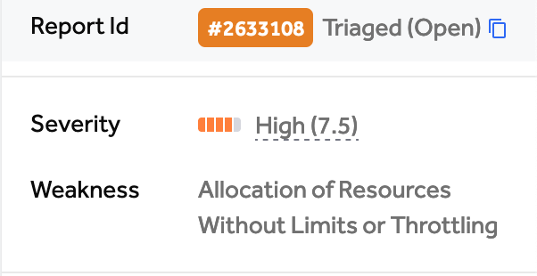

# Exposing hidden DOS techniques laying in plain sight.

Hello everyone! Since I always love giving back to the community, in this post, I'll be sharing a few techniques I've leveraged to identify DoS vulnerabilities in bug bounty programs. There's a common misconception around DoS and DDoS, especially as some programs mistakenly list 'DoS' as out of scope when they actually mean 'DDoS.'

The distinction is important: **DoS (Denial of Service)** refers to a single source attempting to overwhelm a target system to make it unavailable for legitimate users, often by exploiting flaws that exhaust resources or cause the application to crash. **DDoS (Distributed Denial of Service)**, on the other hand, involves multiple sources — often a network of compromised devices (botnet) — coordinating to flood the target with traffic.

While DDoS attacks typically require substantial resources and are frequently categorized as out of scope in bug bounty programs due to the network-level impact and potential legal concerns, DoS vulnerabilities often arise from specific weaknesses in the application layer that can be exploited by a single user. Many programs consider these in-scope, as addressing these vulnerabilities is crucial for ensuring application stability and security.

So lets go forward exploring those techniques.

---

## 1- Missing checks on rendering images' parameters (height and length)

sometimes you will upload a profile picture or a picutre of a specific product, check the rendering page as it might be taking parameters responsible for the resolution of that image. In my case this led to a DOS on the customer's website even so fast that this was fixed before traigging its report. ( led to closure as an info, they discovered it before they looked at my report, bb is a scam :P )

## 2- Found a url/parameter that was taking a url and based on that value, the server would go fetch it for you based on that data you enter? you might've tried getting SSRF and it didn't work!

Now what you are going to do is simply go to https://ash-speed.hetzner.com/ and grep a test file ( around 1–10 GB) and if the server waits for that url to finish, you can flood the server with such requests that would take it done eventually :)

In my case this happened in a different way, there was a biling function and that billing function was taking a payment uuid and giving back its PDF uploaded to AWS. Neither IDORs nor SSRF worked. but I noticed that it was taking a list instead of a url, thoughts? send a list containing 1000 uuid! result? -> time out after 60 seconds with a lag on the website.

few requests and the site was down.

## 3- Identify services fetching data from external resources.

In my case I found that fetching products were done from a certain service that took strange parameters. I looked up where would those parameters get passed to, did some recon and stumbled upon a 3rd party documentation stating how to use those parameters, they are harmless by design. but I noticed something strange, the 3rd party website had a rate limit and the website I was testing was not since it wasn't actually a sensetive action. what did I do? used FFUF with 1000 thread in order to exahust the 3rd party application's rate limit and afterwards the site I was testing on went out of service as the 3rd party was not actually responding to it since it passed the rate limit. :)

---

In conclusion, I want to highlight that you need to push your mind to think of invisible attack vectors that might be hidden in front of you. all of those functions were not vulnerable to common vulnerabilities ( idors/ ssrf / sqli ) but if you don't set limits to your mind, you certainly get few nice bugs.

till next time!
