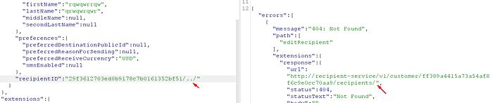
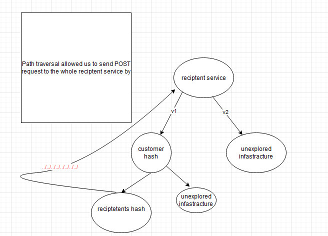

# Graphql path traversal lead to disclosure of PII.

Hi,

I'm here to share a path traversal bug I found on a private program on h1 which allowed me to access restricted internal API with unrestricted privileges.

## TL;DR:

found a graphql endpoint that takes ID as a parameter and using path traversal I was able to find other confidential data of other people.

Now i'll be sharing how I stumbled across this request.

At first I was exploring the application and found that it uses both GraphQL/rest api endpoints.

after going through some of the requests, i found a request that was responsible for editing customers' address using customer ID so I tried inserting ../ after the id and I recieved the following error message



So as I said in my tweet that I actually tried to simply insert other user's address id and I received 404 not found. how this vulnerability occur and how is the payload constructed ? internal api queries the recipetent data based on the recipientID but how is it constructed?

When I tried to simply put the hash of a victim, I recieved a 404 not found with the following path

```
http://recipient-service/v1/customer/e2efd53c83740ba367a52c1d94810e7d/recipient/victimrecipienthash
```

Then I thought if the website don't trim the ../ I might be able to use path traversal to query other internal paths/ or go to other customers data based on customer hash. So we inserted `test/../../../` and the endpoint responeded with path not found with the following path

```
http://recipient-service/v2/customer/
```

So we know that we can manipulate the URL and hopefully to get a neat way to hit other internal endpoints:)

afterwards i got a hash of my victim account + hash of reciptient in the victim account and inserted it in this way

```
http://recipient-service/v1/customer/victimaccount/recipient/victimrecipienthash
```

with the followin payload `test/../../../victimaccount/recipient/victimrecipienthash`

And i was able to query the data/modify it of that recipient. I 100% believe that what's important that the ability for the attacker to go to any internal path in that service meaning it's an ssrf but It's limited to the reciptent micro service they have. I tried to esclate it by trying to fuzz for different internal urls and I was able to send POST requests to other similar endpoints and I shared this info with team and they accepted it as a high finding based on how this would actually affect customers' data.

Here's a diagram of how we can use this attack in attacking different users and trying to access confidential data on this service



I hope this added some knowledge to you, thanks for reading and wait for more writeups soon.
