# The Great Chain of Duplicates: Utilizing Javascript and Logic in the Bug Bounty Field

Hi, in this blog I'll walk you through how analysing javascript files and chaining bugs made me so close to get some bounties. This might be a long blog but i'll try to split it into several points/ reports. I'll also share my methodolgy in analysing minified JS files.

---

let's start with setting up the environment. So first thing I do in a website is simply browsing, keep poking around and touching functions, check wappalyzer to know which stack it's using while burp is already in background. after a bit, I take some random paths from burp history that were interacting with the website API to get the js files that might be actually interesting

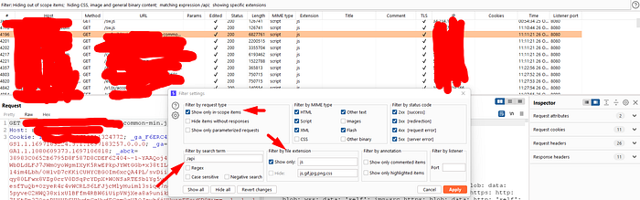

Certainly looking at this

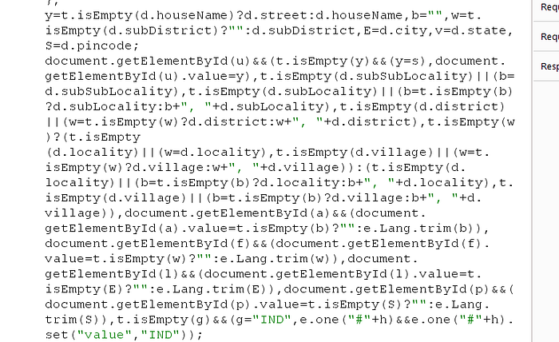

might feel overwhelming so we try a couple of things.

first we try to add .map to the end of the js file url to see if we get anything back and last we look in the file for .map as it might be embedded in some comments. If we manage to get the .map files our life will be easier but if we didn't that's not the end of the road :) we will go to https://beautifier.io/ and insert our ugly js file and this site will try to beautify it.

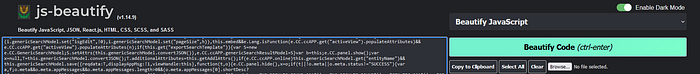

before

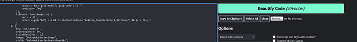

after

then we take the result in put in Visual studio code and set language to typescript and yes, this is a lot easier to read and take notes rather than tracking it on Burp suit.

---

Great! with this in hand let's see I was able to dumb 500K PII including emails/names/phonenumbers and addresses .. it'll be 3 parts

The first part is about understanding the website functionalities, second and third are bugs that i chained with previous knowledge based on part 1

---

## Part 1: Understanding the Search Function

So, visiting my target I found a request appeared in my burp and at first glance i thought it was responsible for searching

It was a post request with the following body

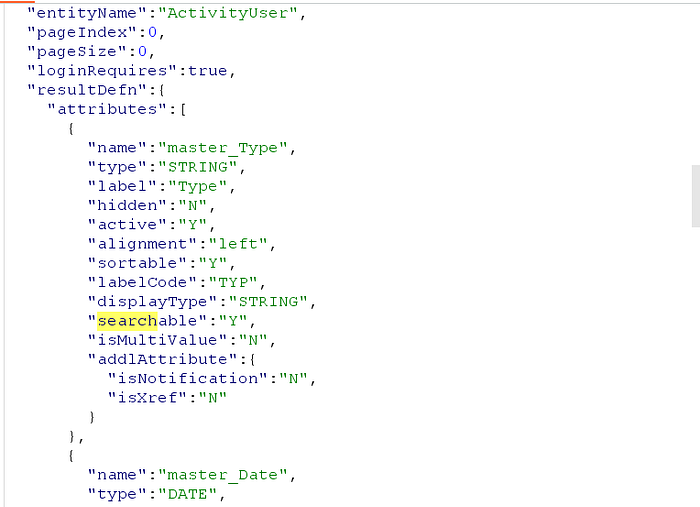

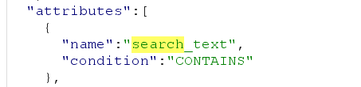

this is some of the parameters it took. Result was some made activity by me. Analysing them was pretty straight forward. resultDefn was needed for us to determine how the result attributes should be like and it also took attributes parameter and it was responsible for taking the search parameters. One important thing also you need to look at is entityName. but why? after inspecting some other requests to that search function I found something odd, some requests to the same endpoint had different entity names, different resultDefn and certainly different attributes. So my first reaction to this — Looking at different names with ( activityUser, activities, products ) — I guessed this model is created to talk to the database directly, i was enlightened to be honest and I said to my self I guess this is a very beautiful feature, it's fuzzing time :O so I kept fuzzing for different entity names or lets say ( Table names ) but came to the sad truth with tons of 404. So what other place is great for finding different entity names? JAVASCRIPT! by searching for an already in hand entity name

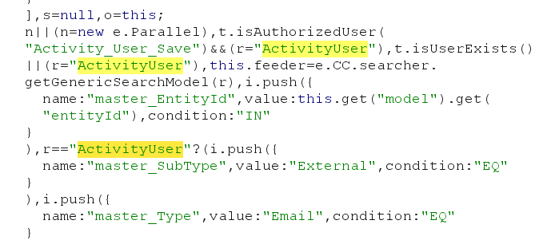

Okay now we know entity names exist in javascript but is there's a sufficent way to extract all of them ? in my case yes but it's not always the case, I simply read the above code and found that it first checks if a user is authorized to access the ( Activity user save ) model then checks if r = activity user so I said ok let's look for r=" in the file we had and the result was astonishing ->

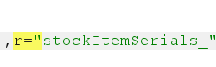

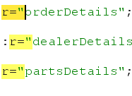

so after we harvested a large set of entity names, we needed to know which entities were valid so we ran burp intruder with the list of entity names we gathered.

Results were divided into 3 categories

1- 404 in case an entity name is wrong

2- 403 if we are not allowed to interact with such entity, ( so there's an actual protection layer)

3- 200 but no data was found

So I first decided that we know how to eliminate the third category so how should we tweak our search so it always yields our data at least?

I noticed this depended on attributes and also Resultattribute params that we menitoned above. So I first omitted the resultAttribute in a valid request that already yielded data before and the result was a so huge, the normal request returned firstname and name of the owner, removing the result param resulted in showing every single piece of data related to this data of ours including admins changed it/updated it etc. So okay now we try this in category 3 we already got but still we recieved no data was found, so I tried doing the same thing with attributes parameter, at first I tried to set SEARCH_Text to * in order to match all data

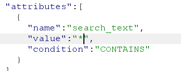

still no data was found. so I tried removing the whole attributes param but I was introduced to a new error that stated that I needed to have a valid attribute parameter. A random thought came to me, what about sending empty {} in the attributes param?

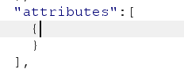

Worked as CHARM, so now our categories got deduced to be either we have access to a specific entity or not. with that in mind I went to try all entites I gathered, found one and managed to get a valid POC to leak firstName and last name but we are after a longer chain aren't we? So now we know the structure of how requests are sent to the api that deals with database.

---

## Part 2: ALL YOUR S3 FILES ARE MINE, BUT PLEASE TELL ME WHAT ARE YOUR FILE NAMES

inspecting and analysing JS lead me to this great snippet

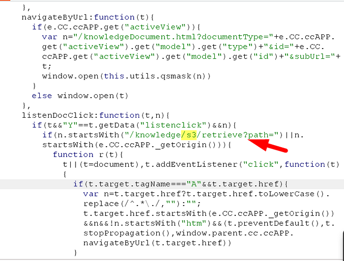

So i wondered if this is what it looks to be :O

Say no more

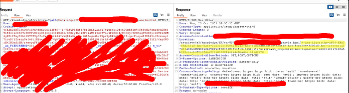

So we are able to create signed urls for any files on a bucket however I wasn't able to actually list those files :/

pathtraversal is not working here but we don't need it as path parameter already is starting from root directory ( I browsed the app and found that uploading any file gets a generated filename which is filename_timestamp so it was infeasiable to target all users )

more info about signed urls here -> https://www.youtube.com/watch?v=MBQJJ3jfJ8k&ab_channel=BugBountyReportsExplained

So now we got 2 pieces :)

---

## PART 3: We Might Need Backups but What Might Go Wrong?

Here comes the missing plot

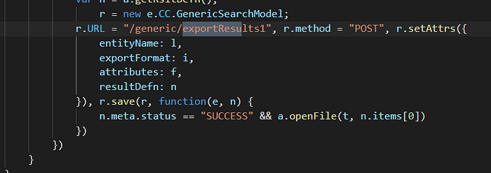

remember the entityName? So what's the difference? here I found out that instead of outputting the data we use in searching, we export it based on the exportFormat. so now we perform the same thing we made when we were analysing the search function

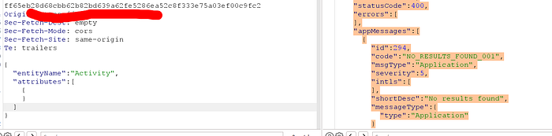

Oh? Why are we getting results not found even tho if we send it in search function it works? what did we do wrong? back to basics, why did we send entityName and attributes only? because we don't know what attributes might be and because we want to retrieve all the result data not a specific piece of the result. hmmm that's alright, could it be the case that because we are not entrying the format of our result we are not recieveing any result? yes that was the case, fixing the issue was by simply sending anything in the result and backend neglected it anyways and sent the whole result D': So I simply went to the original request for the search function

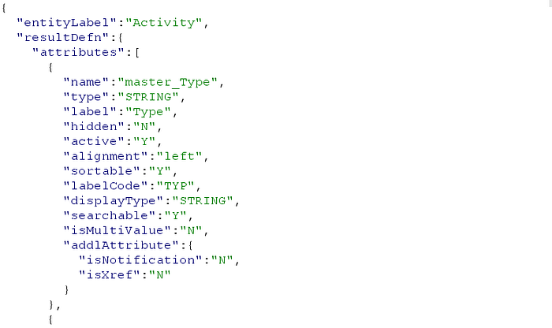

that resulted a third category having 200 but no result and tried it here and guess what?

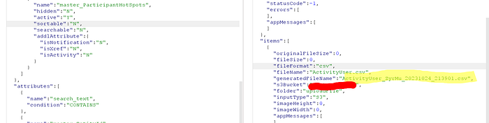

Using bug 2 that we already had

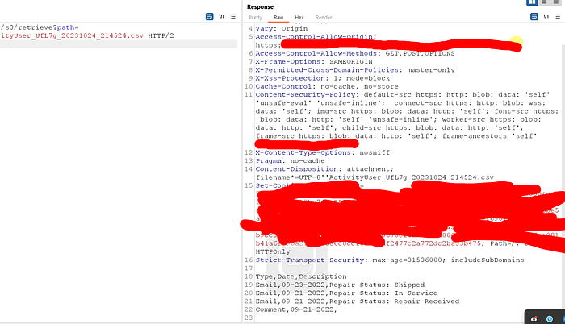

GREAT! we managed to export our data can but how can we use this against other users? now the haunt begins again with a goal of finding some parameters to put in the attribute as in the original search for example it had this but wasn't vulnerable to idor

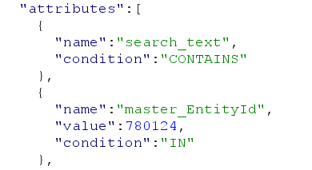

but in this export url, this was vulnerable and gave us different user activity ->

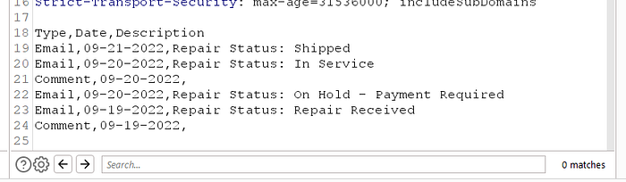

but as you see, there's no confidential data :( ?

Now let's go back for category 2 entity names that gave us access denied

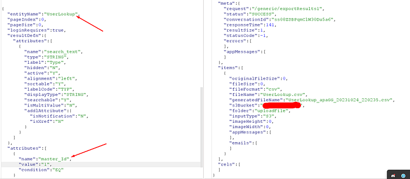

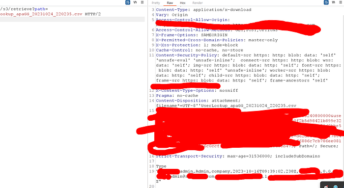

RIP MR developer :(

every entity that gave me access denied was here giving me much data and joy

here's for instance logs of loggin into account ( MAC — IP — OS etc)

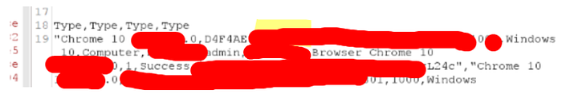

So now we got a very nice chain of bugs that resulted in leakage of around 500K records of customers and much more info from all entites in the back end. I hope this enriches your knowledge and let me know what you think about it :D
