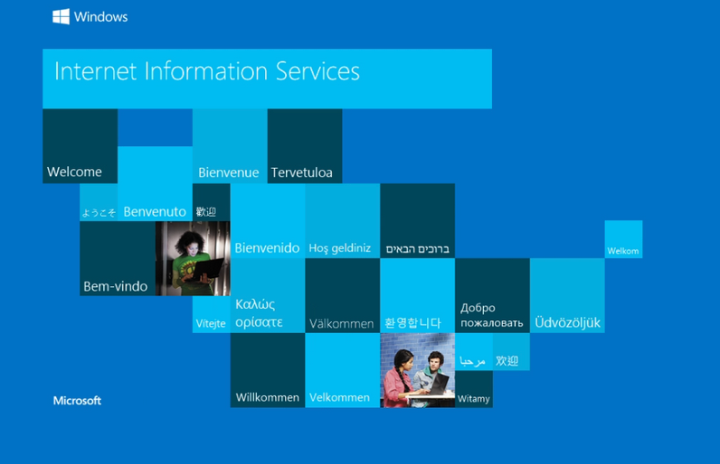
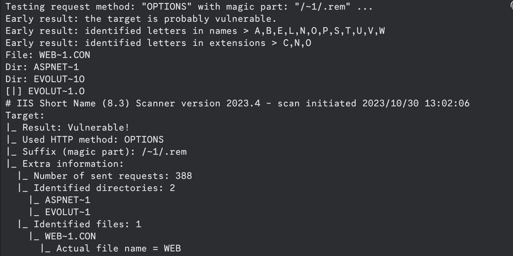
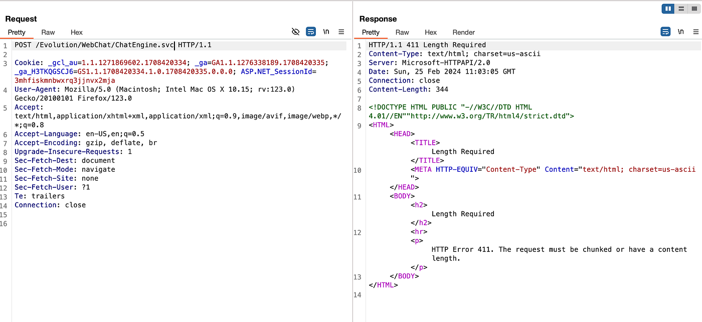
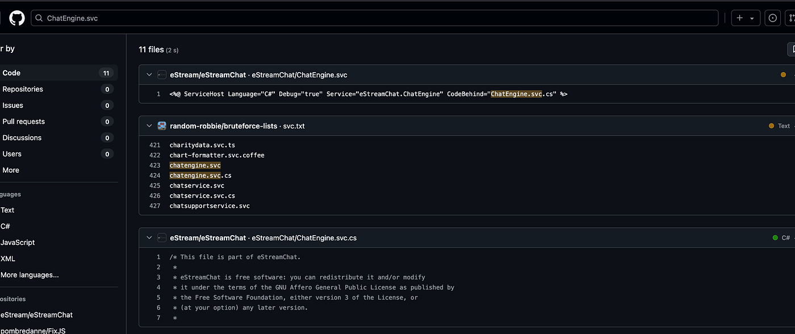
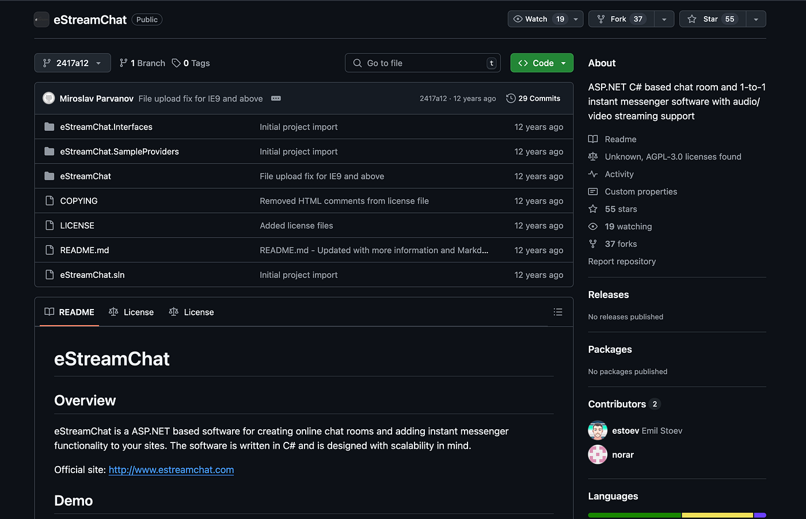
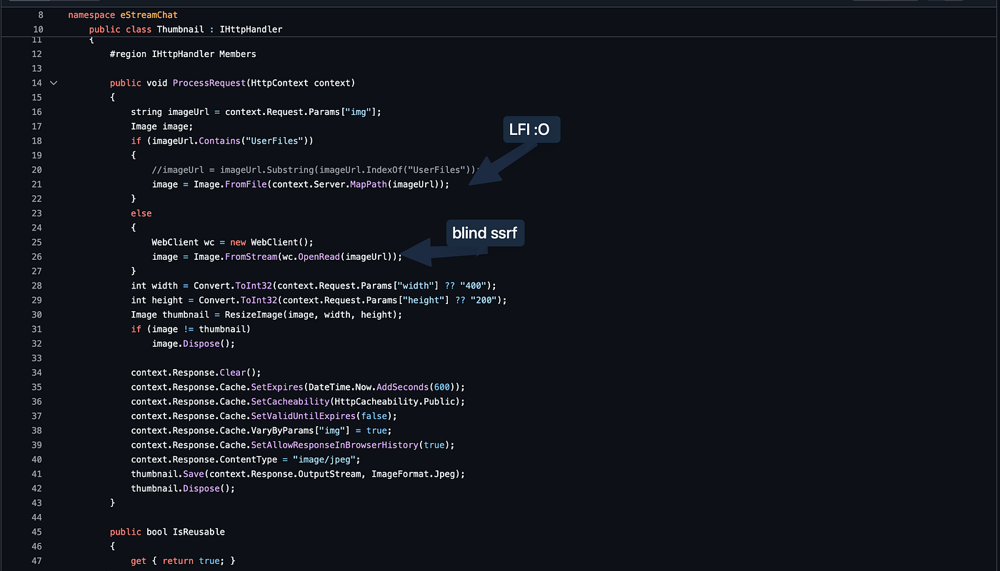
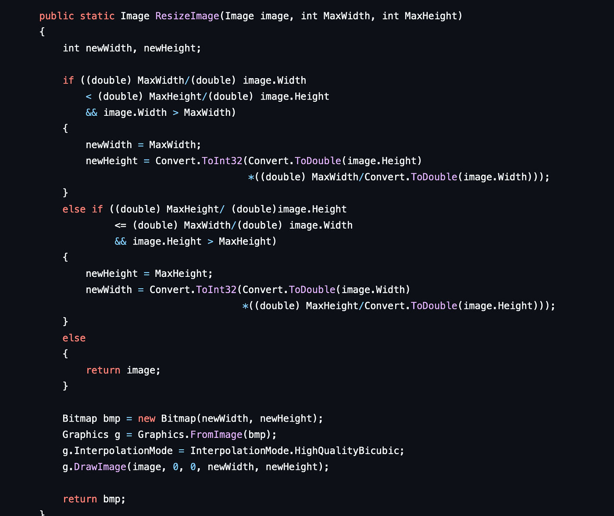
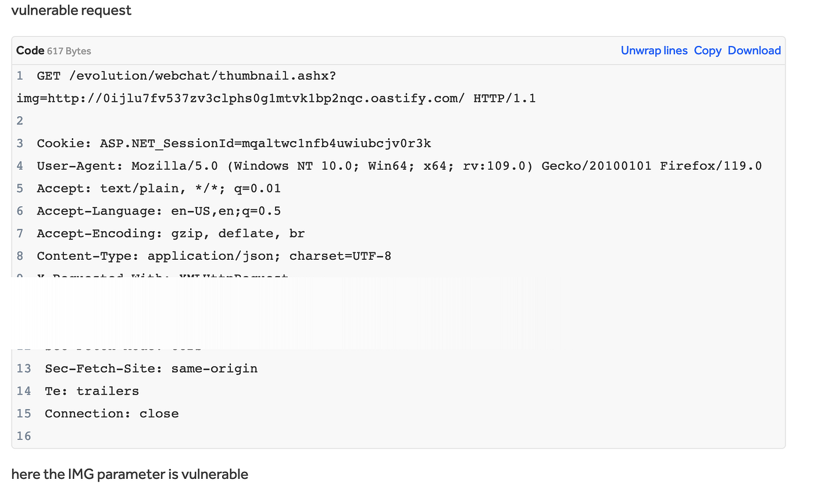
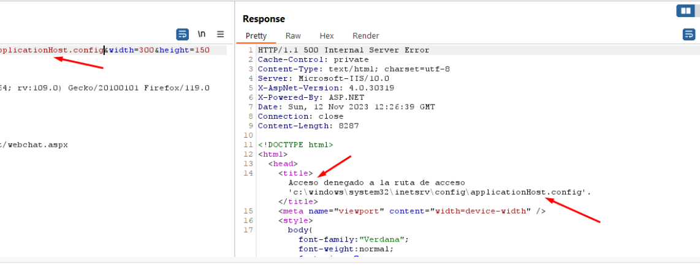
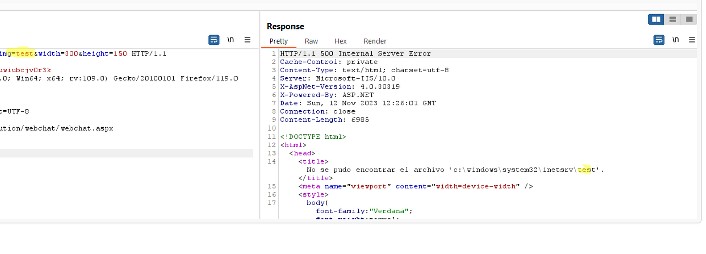

# IIS welcome page to source code review to LFI!

Hi, in this writeup I'll walk you through how I managed to get a limited Local file disclousre (LFI) / Blind SSRF.

## TL;DR:

found an IIS welcome page, enumerated directories& files using IIS Short name scanner and FFUF, found an open source webchat software, source code review led to LFI and blind SSRF.

So, I had this subdomain that returned the IIS welcome page ->

then I used [https://github.com/irsdl/IIS-ShortName-Scanner](https://github.com/irsdl/IIS-ShortName-Scanner) before fuzzing and It showed that this target was vulnerable to [IIS Short File Name Disclosure](https://github.com/irsdl/IIS-ShortName-Scanner/blob/master/presentation/Steelcon-2023-Beyond_Microsoft_IIS_Short_File_Name_Disclosure.pdf).

after finding those, use ffuf to try to find those files, I found that one of the folders is EVOLUTION! then I ran the tool again & so on and so forth till I reached finally to this path

but before going forward I thought about maybe this web chat is open source, is it? turns out it is!

My first impression was if it's created 10 years ago, they didn't know what security means back then, right? ¯\_(ツ)\_/¯

digging through the source code I found the following snippet:

[https://github.com/eStream/eStreamChat/blob/2417a12c0999609e3feedbf5281d07393b126c23/eStreamChat/Thumbnail.ashx.cs](https://github.com/eStream/eStreamChat/blob/2417a12c0999609e3feedbf5281d07393b126c23/eStreamChat/Thumbnail.ashx.cs)

Looking at the source which is in this case the img parameter which took a parameter "img" and based on its value it interpreted it in 2 different ways, if it found UserFiles in the value of that parameter, it would try to query it from the server directly (LFI) which can be trivially bypassed using path traversal, `UserFiles/../wheredoyouwannago`

and in the second case it would do a request on the server's behalf to the url you specify :). However, through analysis we can find that the response isn't directly returned but in fact it goes into ResizeImage function which sadly wouldn't accept the type of data we are trying to return unlessi it's an image.

so we could exfilterate images on the server or perform Blind SSRF by simply hitting that endpoint

when trying the LFI on our server, it turns out it didn't need to specify the UserData path:

I hope this writeup added some fresh ways of thinking & valuable information to you!

till we meet again :)
