# Leaking PII at Scale: How Third Parties Can Unintentionally Put Your Data at Risk.

Hello Everyone, I wanted to share with you how I discovered a misconfiguration on a website offering software services and was able to enumerate all organizations relying on it that had that misconfiguration.

The target offers you the ability to build custom apps with " no code " meaning it's an easy way for you to get an application mainly for forms/user requests/ etc.

To further clarify this situation, it's important to note that while the platform in question wasn't a traditional third-party service, it acts as a foundational tool for building custom applications. The vulnerability here could be classified as a supply chain vulnerability because the platform's internal misconfiguration affects all websites and applications built on it. This highlights a critical risk in relying on third-party platforms or services for web development — misconfigurations in these platforms can introduce vulnerabilities across a wide range of sites and applications.

It all started with a subdomain on HackerOne, which was leveraging this no-code platform. I noticed a request being sent in the background that looked something like this:

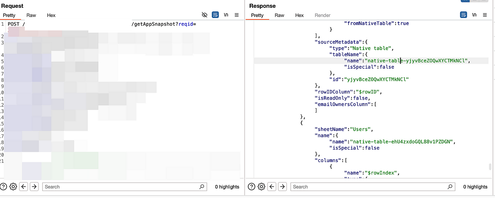

At first glance, the request seemed to contain nothing but sheet and table names along with some data that didn't appear to be of much interest. But curiosity got the better of me, and I decided to dig deeper into the behavior behind it. I wanted to understand what these tables were and, more importantly, how I could access the native tables they referred to.

After some investigation, I found that there was another background request being sent to load example data from Firestore. This was when things started to click.

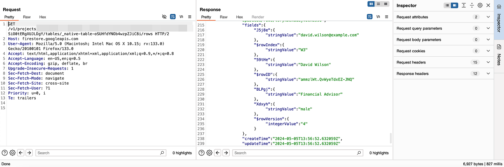

I analyzed the request and realized that it was structured like this:

> `https://firestore.googleapis.com/v1/projects/TargetName/databases/(default)/documents/Target-apps-v4-data/subdomainId/tables/_nativeTableId/rows`

Now that I had figured out the process, I understood that all I needed to do was obtain the table IDs, and I could start collecting information from these tables. However, things weren't as simple as I initially thought. Not all of the tables were publicly accessible.

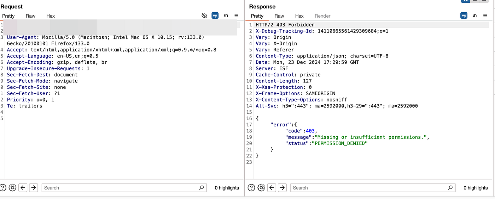

At this point, I was puzzled. This behavior looked like a classic misconfiguration. What was causing this inconsistency? To investigate further, I decided to go directly to the target website. Until now, I had only been interacting with a subdomain that was part of the application I was testing on HackerOne.

I logged in and created a new application to see how the system worked from the inside...

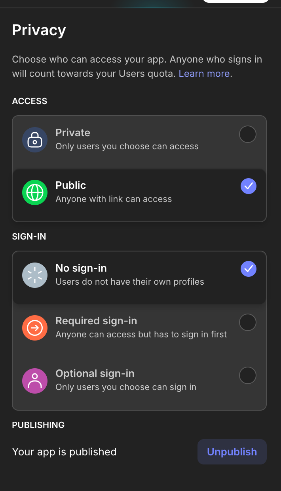

analysing those settings and playing with them I discovered that if you are setting you application to be public, the tables would in return become public accessible. And this is only the case if you are using the tables offered by the target it self, if you are creating your own tables, they don't comply to these privacy settings and they are private by default.

Great now that I now have this information, how can we actually know the amount of affected websites? I started analysing javascript but found nothing so I started fuzzing on the firestore link we found intially through different combinations till I found the following

> `https://firestore.googleapis.com/v1/projects/TargetName/databases/(default)/documents/app-logins`

This endpoint listed 20 applications and their subdomains on the platform, with a token to continue listing more applications.

I quickly wrote a simple script to collect all the subdomains, a process that took about 3-4 hours to complete, gathering data on 1.2 million subdomains.

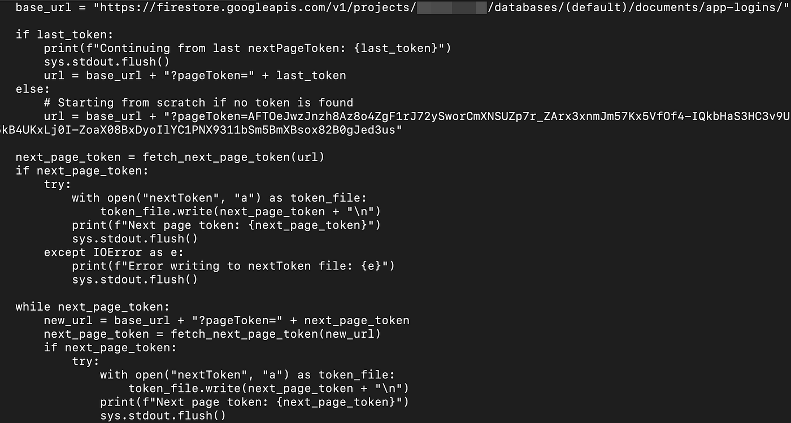

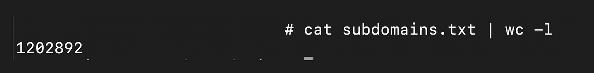

I then created another script to automate the initial request that would give me the native table IDs, preparing them for the next step.

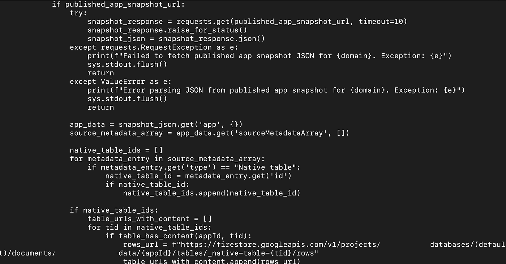

The rest of the script was focused on checking whether these tables were publicly accessible or not. Initially, I discovered thousands of exposed tables, but I considered the possibility that many of them were simply test applications or small apps being built. So, I added an additional condition: for a table to be eligible to be considered as leaked PII, it had to contain at least 30 entries.

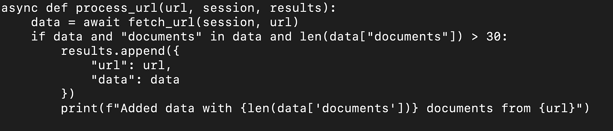

With this criteria in place, I continued my enumeration and identified the websites affected by the vulnerability. Out of the 1.2 million subdomains I scanned, I found 720 hosting data leaks.

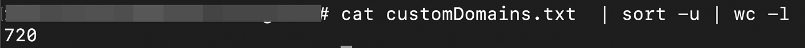

Of those, only one program had a bug bounty program, which was the one that had initially drawn me into this process. For my efforts, I received an award for two high-severity vulnerabilities: one for the widespread exposure (since it affected more than one subdomain, it was flagged as a duplicate), and another for the same mistake being repeated once again, which I later reported again.

PII example ->

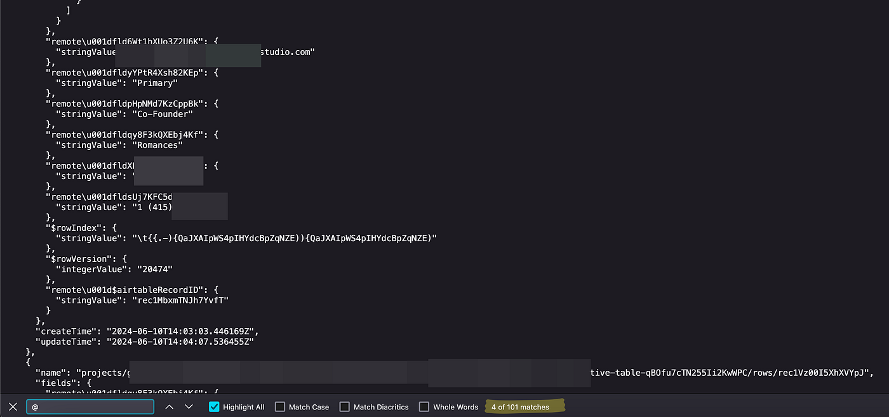

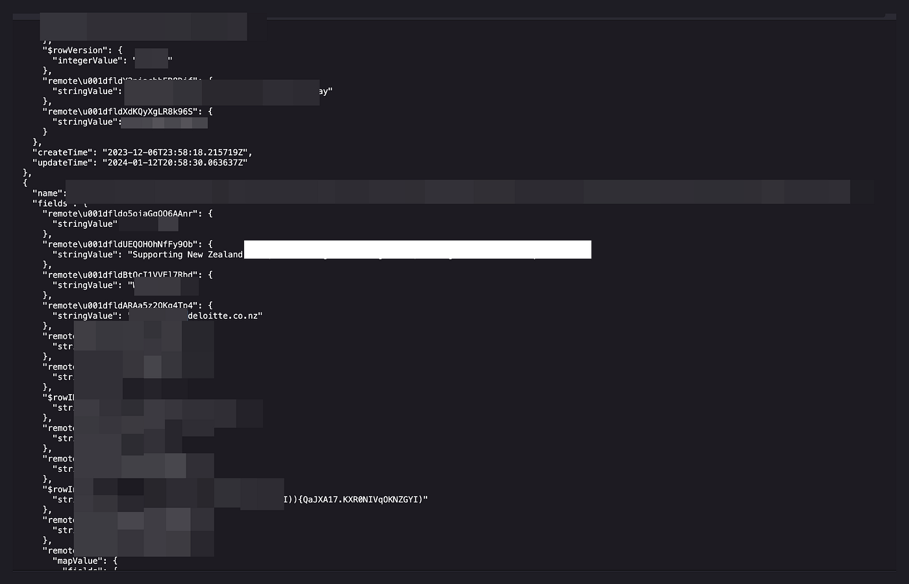

Contacting most of these organizations didn't yield any results, as many of them didn't even respond. This highlights the urgent need for companies to establish clear policies for reporting security issues that affect their websites even tho I was lucky enough to get 4 digits bounty twice for this finding.
